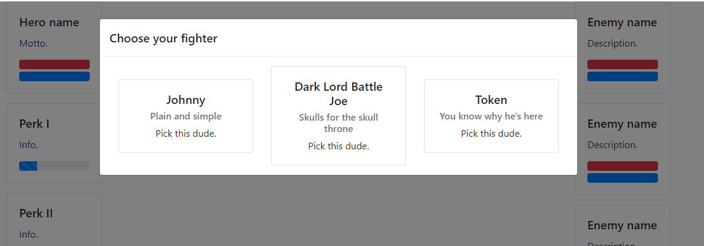
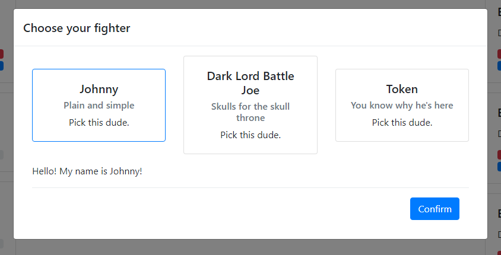
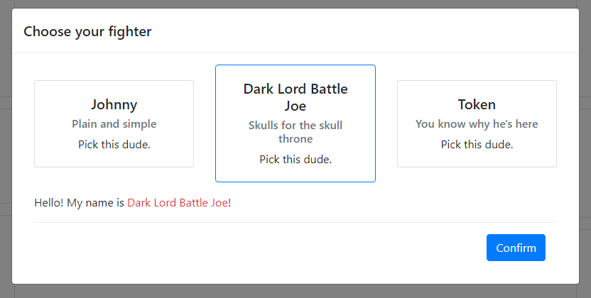
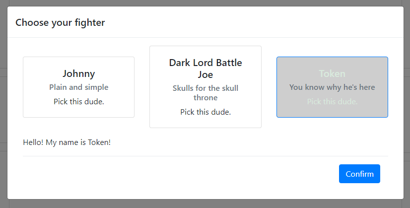

# 15 практика

## Задача
Изучить язык `TypeScript` а также основы объектно-ориентированного программирования. 

## Исходники
Приложение с базовым `Layout`.

## Результат
Простая пошаговая игра, в которой доступно 2 экрана: 
### Экран выбора персонажа



*Экран выбора персонажа*

Представляет собой модальное окно, открытое по-умолчанию. Окно нельзя закрыть, не выбрав персонажа. 
При клике на персонажа отображается выделение (рамка) и срабатывает уникальная реация персонажа на выбор. 



*Экран выбора персонажа: Первая реакция*



*Экран выбора персонажа: Вторая реакция*



*Экран выбора персонажа: Третья реакция*

Реакции приведены для примера, рекомендуется проявить креатив. 

### Экран ведения боя


*Экран боя*

На данном экране в левой колонке располагается карточка выбранного героя, а под ней 3 спец способности. Каждая из них имеет progress-bar обозначение готовности использования (восстанавливается каждый ход на N%, уникально для каждой способности), название, описание. При активации может тратиться мана и происходить какая-то реакция. Влиять можно как на героя, так и на врагов. Для каждого героя рекомендуется сделать уникальный набор способностей, но не обязательно создавать 9 различных способностей, можно комбинировать так, чтобы множество в целом было уникально.

Предлагаемый список способностей: 
* Жертва: Потерять часть HP, восстановить много маны.
* Самолечение: Потратить ману, восстановить HP. 
* Сильная атака на одного врага. 
* Атака против всех врагов.
* Поджечь врага.  
* Простой удар. 
* Пропустить ход. 

В правой колонке располагаются враги. На старте имеется только один враг, но время от времени могут появляться новые враги. Максимальное количество врагов на экране выбираете вы (не менее 2-х), так же как и количество типов врагов (не менее 3-х). У каждого врага есть HP, Mana, а также набор способностей (Не менее 2). 

Ходы чередуются между Игроком и командой врагов, то есть враги ходят чередуясь с Игроком. 

Центральную область предлагается использовать для отображения хода битвы (в любом виде).

### Структура классов

Предлагается использовать следующую структуру классов: 
```js
class Game {
    constructor(public Char: Character) {}
    public StartGame(): void {
        // ...
    }
    public isHeroTurn: boolean = true;
    public Enemies: Unit[] = [];
    public NextStep(): void {
        // ...
    }
    // ...
}  
class Unit {
    constructor(public name: string, protected MaxHP: number, protected MaxMana: number) {
        //...
    }
    public MoveSet: Move[] = []; 
    private _HP: number; 
    public get hp(): number {
        //...
    }
    public set hp(n: number) {
        //...
    }
    private _mana: number;
    public get mana(): number {
        //...
    }
    public set mana(n: number) {
        //...
    }
    
}
class Enemy extends Unit {
    constructor(public name: string, protected MaxHP: number, protected MaxMana: number) {
        //...
    }  
}
class Move {
    constructor(public name: string, public description: string) {
        //...
    }
    public Execute(targets: Unit[]): void {
        //...
    }
}
//Пример способности
class Sacrifice extends Move {
    constructor() {
        //...
    }
    public Execute(targets: Unit[]): void {
        //...     
    }
}
class Character extends Unit {
    constructor(name: string, MaxHP: number, MaxMana: number, protected selector: string, public motto: string) {
        //...
    }
    public Greet(): void {
        //...
    }
    public ActSelected(): void {
        //...
    }
    public ActDeselected(): void {
        //...
    }
    protected _Highlight(): void {
        //...
    }
    protected _DeHighlight(): void {
        //...
    }
}
class Dude extends Character {
    constructor(public name: string, MaxHP: number, MaxMana: number, protected selector: string, public motto: string) {
        //...
    }
    public ActSelected(): void {
        //...
    }
}
class Token extends Character {
    constructor(public name: string, MaxHP: number, MaxMana: number, protected selector: string, public motto: string) {
        //...
    }
    public ActSelected(): void {
        //...
    }
    public ActDeselected(): void {
        //...
    }
}
class BattleJoe extends Character {
    constructor(public name: string, MaxHP: number, MaxMana: number, protected selector: string, public motto: string) {
        //...
    }
    public ActSelected(): void {
        //...
    }
    public ActDeselected(): void {
        //...
    }  
}
```

## Референс

### Использование TS в VisualStudio

Так как мы уже знакомы с менеджером пакетов npm, то предлагается продолжить его использовать.
Для того, чтобы начать использовать `TypeScript` в вашем проекте, нужно сделать следующее: 

#### Создание файлов с исходным кодом

В корне проекта создадим папку `TScript` и добавим в неё файл `file.ts` (Тип: TypeScript).
Далее, создадим конфигурационный файл в той же папке и назовём его `tsconfig.json`. Заменим в нём содержимое на следующее: 
```js
{
  "compileOnSave": true,
  "compilerOptions": {
    "noImplicitAny": false,
    "noEmitOnError": true,
    "removeComments": false,
    "sourceMap": true,
    "target": "es5",
    "jsx": "react",
    "lib": [
      "dom",
      "es5",
      "scripthost",
      "es2015.promise",
      "es2015.iterable",
      "es2015.collection"
    ]
  },
  "exclude": [
    "node_modules",
    "bin",
    "obj",
  ]
}

```
Здесь мы задали параметры компиляции, подключили библиотеки и определили, какие файлы будут компилироваться. 

#### Подключение пакетов

Для подключения пакетов необходимо создать известный вам файл `package.json`, который необходимо поместить в корне решения (.sln файла\папки).

В него достаточно написать: 
```js
{
  "version": "1.0.0",
  "name": "asp.net",
  "private": true,
  "devDependencies": {
    "del": "2.2.0",
    "gulp": "3.9.0",
    "gulp-concat": "2.6.1",
    "jquery": "3.3.1",   
    "@types/jquery": "3.3.10",
    "@types/bootstrap": "4.1.2",
 
  }
}
```

Важно подключать 
```js
 "@types/jquery": "3.3.10",
 "@types/bootstrap": "4.1.2",
```
в конце!
#### Gulp-файл
После создания файла `gulpfile.js` в корневой папке, запишем в него следующее: 
```js

const gulp = require("gulp");
const concat = require("gulp-concat");
var del = require('del');

const vendorScripts = [
    "node_modules/jquery/dist/jquery.min.js",
    "node_modules/popper.js/dist/umd/popper.min.js",
];

gulp.task("build", ["clean", "build-vendor", "default"]);

gulp.task("build-vendor", ["build-vendor-js"]);

gulp.task("build-vendor-js", () => {
    return gulp.src(vendorScripts)
        .pipe(concat("vendor.min.js"))
        .pipe(gulp.dest("wwwroot/scripts"));
});

var paths = {
    scripts: ['TScript/**/*.js', 'TScript/**/*.ts', 'TScript/**/*.map'],
};

gulp.task('clean', function () {
    return del(['wwwroot/scripts/**/*']);
});

gulp.task('default', function () {
    gulp.src(paths.scripts).pipe(gulp.dest('wwwroot/scripts'))
});

gulp.task("default:watch", function () {
    gulp.watch("TScript/**/*.ts", ["default"]);
});
```

При желании, можно подключить `Bootstrap` и `SASS` используя инструкцию из [13](../Frontend13/Frontend13.md).
### Язык TypeSript

[Справка по языку](https://metanit.com/web/typescript/2.1.php)

Рекомендуется ознакомиться с Главой 2, Главой 3

В задании обязательно использовать: 
* [Классы](https://metanit.com/web/typescript/3.1.php)
* [Модификаторы доступа](https://metanit.com/web/typescript/3.4.php)
* [Методы доступа](https://metanit.com/web/typescript/3.10.php)
* [Наследование](https://metanit.com/web/typescript/3.2.php)
* [Строгую типизацию](https://metanit.com/web/typescript/2.5.php)
